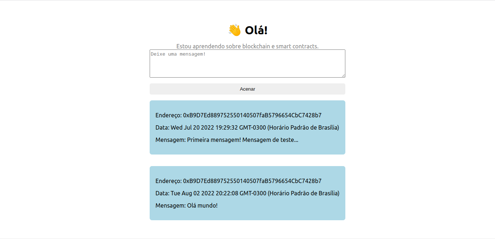

As mensagens são armazenadas na blockchain de teste Ethereum Rinkeby. Cada mensagem envolve uma cobrança de gas-fee. É necessário a carteira metamask para utilizar a aplicação.

O front-end foi escrito usando ReactJS.

Link da aplicação: https://waveportal-starter-project.andrewenrique.repl.co/

## Front-end

